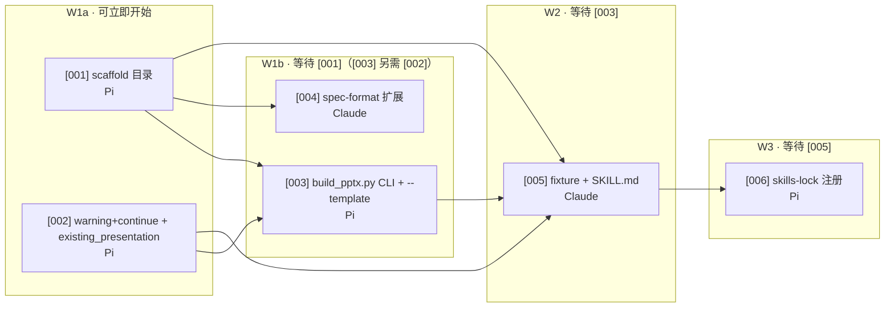

# Handoff · spec → tickets

> **日期**：2026-09-18
> **来源阶段**：spec（1 份设计稿）
> **目标阶段**：tickets（6 张实现票 + 1 张 INDEX）
> **写入位置**：`.workflow/tickets/001-json-to-ppt-v1/`

---

## Source

来自 [`.workflow/specs/json-to-ppt-skill.md`](../specs/json-to-ppt-skill.md) + 上游 handoff [2026-09-18_research-to-spec.md](2026-09-18_research-to-spec.md)。

**本批次对照 spec 锁定的 8 个决策 + 5 条工程决策**：

| spec 决策 | ticket 承载 |
|:--|:--|
| 单独 `skills/json-to-ppt/` 目录 | T001 |
| 100% 向后兼容（不动旧 spec） | T004 |
| v1 不带 `--validate` | （无 ticket——v1 显式不做） |
| warning + continue 错误行为 | T002 |
| 复用现有渲染层（python-pptx） | T002、T003 |
| 入口脚本独立 + `--template` 参数 | T003 |
| 全页图片防护保留 | （在 T002 / T004 中沿用旧 `validate_editable_pptx.py` 行为，不单独立 ticket） |
| 不做动画 | （无 ticket——v1 显式不做） |

---

## Target

产出落在 `.workflow/tickets/001-json-to-ppt-v1/`：

| 输出文件 | 角色 | 派发 Agent |
|:--|:--|:--|
| [00-INDEX.md](../tickets/001-json-to-ppt-v1/00-INDEX.md) | 批次拓扑 + 派发清单 + Done Criteria | — |
| [001-scaffold-skill-directory.md](../tickets/001-json-to-ppt-v1/001-scaffold-skill-directory.md) | scaffold `skills/json-to-ppt/` 目录 | Pi |
| [002-warning-continue-error-path.md](../tickets/001-json-to-ppt-v1/002-warning-continue-error-path.md) | 元素级异常 → warning，继续 deck | Pi |
| [003-build-pptx-cli-shell-with-template.md](../tickets/001-json-to-ppt-v1/003-build-pptx-cli-shell-with-template.md) | 新 CLI 入口 + `--template` 追加 | Pi |
| [004-extend-spec-format.md](../tickets/001-json-to-ppt-v1/004-extend-spec-format.md) | `references/spec-format.md` 是旧 spec 的超集 | Claude |
| [005-test-fixtures-and-skill-md.md](../tickets/001-json-to-ppt-v1/005-test-fixtures-and-skill-md.md) | 4 fixture + pytest + 新 SKILL.md | Claude |
| [006-skills-lock-registration.md](../tickets/001-json-to-ppt-v1/006-skills-lock-registration.md) | `skills-lock.json` 新增条目 | Pi |

下游消费者：每个 ticket 由对应 Agent 执行；INDEX 由 dispatcher 用来决定派发顺序。

---

## Decisions preserved（继承自 spec + 本批次锁定）

### 继承自 spec（不再变更）

- 同 [research-to-spec handoff §Decisions preserved](2026-09-18_research-to-spec.md#decisions-preservedspec-锁定的-8-个决策) 的 8 + 5 条，本批次 ticket 不允许越界。

### 本批次新增（2026-09-18 拍板）

#### T003 `--template` 实现路线：✅ 选定选项 a

详见 [003 的 🧭 上下文](../tickets/001-json-to-ppt-v1/003-build-pptx-cli-shell-with-template.md#-上下文) 三方案对照表。后果是 **T002 与 T003 串行**——T002 PR 必须先合 T003 才能开工；T002 的任务描述已扩展为「同时给 `build_pptx()` 加 `existing_presentation` 参数」。

> **链路同步**：选 a 后，T002、T003、INDEX 三处决策文档已对齐（grep 关键词 `existing_presentation` 在三个文件里都能命中）。

#### T002 ↔ T003 PR 合并策略

- **推荐拆 PR**：T002 PR 落合 → T003 rebase 上去。便于 review 与回滚。
- **允许同 PR**：如果 rebase 冲突难解，合并为一个 PR 也接受——但 review 粒度更粗。

#### T004 spec-format 扩展范围（写入 T004 的设计依据）

- **必扩**：`slide.template`、`background.image`
- **未决议**：`slide.layout`（layout 名称映射）、`element.animations`（schema 占位但 v1 不渲染）
- 决策时点：T004 开工时拍板

#### T005 fixture 数量（写入 T005 的设计依据）

- **至少 4 个**：纯文字、多元素、表格、含模板路径
- **建议加第 5 个**：含坏元素（验证 Q4 warning 行为）
- 决策时点：T005 开工时拍板

#### 阻塞边口径统一（2026-09-18 修订，派发前）

派发前扫出 INDEX 与 ticket 文件两处阻塞边不一致，已统一到「**ticket 自己的 `## 🚧 阻塞` 段是唯一口径**」，INDEX 与本 handoff 的拓扑图改为与之一致：

| ticket | 修订前（INDEX / handoff） | 修订后（= ticket 文件） | 理由 |
|:--|:--|:--|:--|
| T002 | 等待 T001 | 无阻塞 | T002 只改旧 `build_editable_pptx.py` 与旧测试，不碰新目录 |
| T004 | 不依赖任何 | 等待 T001 | T004 要写 `skills/json-to-ppt/references/spec-format.md`，目录由 T001 建 |

连带效果：W1a 从「T001 + T004」变成「T001 + T002」；T004 挪到 W1b 与 T003 并行。T001→T002 这条边从拓扑里消失。

#### 状态行补齐（2026-09-18 修订，派发前）

6 张 ticket 首行补上 `<!-- status: todo -->`——`/dispatch` 第 1 步靠这行扫未完成 ticket，此前只能手抄 INDEX 的分派清单。

#### T003 追加三条设计约束 D1/D2/D3（2026-09-18，T002 落地后实测）

T002（warning + continue + `existing_presentation`）实测后发现，只加 `existing_presentation` 不足以让 `--template` 真的"保留模板"：

- **D1 模板尺寸优先**：`build_editable_pptx.py:502-503` 无条件覆盖 `slide_width/height`——实测 10×7.5in 模板传入后输出变成 13.333×7.5in。规则：模板模式以模板尺寸为准，spec 的 `slide_size` 不一致时忽略并 warning。T003 的「不修改旧文件」约束在此处放宽。
- **D2 版式选择**：`build_editable_pptx.py:505` 硬编码 `slide_layouts[6]`，模板版式少于此数会 IndexError。规则：按名称挑 `blank`/`空白`，挑不到退回索引 6，越界必须明确报错非零退出。
- **D3 参数口径**：统一 `--spec/--out`，`--template` 为可选追加项；T003 原验收命令误写的位置参数已改正。

三条已写入 [003 的「🧷 已拍板的设计约束」](../tickets/001-json-to-ppt-v1/003-build-pptx-cli-shell-with-template.md) 并反映到验收标准 6/7，INDEX 的「派发后追加的三条约束」与之互为冗余。

#### 已知豁免（2026-09-18）

T002 的验收标准 2（在 `tests/test_editable_pptx_skill.py` 加坏元素端到端测试）**未做且经确认不补**：代码行为已由人工实测覆盖（坏元素 → exit 0 + stderr `Slide 1 element 1` + 后续元素照常渲染），但仓库里没有对应的回归测试。T003 会继续改同一个函数，此处无自动化防护网。

---

## 拓扑与依赖（本批次锁定）

并发上限 3：W1a 跑 T001 + T002 并行（文件不重叠）；W1b 跑 T003 + T004 并行；W2 单跑 T005；W3 单跑 T006。

---

## Open questions（留给下游 ticket 开工时拍板）

| # | 问题 | 拍板 ticket | 拍板时点 |
|:--|:--|:--|:--|
| 1 | T004 是否引入 `slide.layout` / `element.animations` 字段？ | T004 | T004 开工时 |
| 2 | T005 fixture 是 4 个还是 5 个（含坏元素）？ | T005 | T005 开工时 |
| 3 | T002 + T003 拆 PR 还是同 PR？ | 派发员 | 派发到 CodeG 时 |

---

## 交叉引用

- 上游：[2026-09-18_research-to-spec.md](2026-09-18_research-to-spec.md) + spec
- 下游：本批次 6 张 ticket 执行完后，下一份 handoff 应该是 `tickets-to-verify`（6 张 ticket 完成情况 → verify 报告）
- 平行：INDEX 文件（[00-INDEX.md](../tickets/001-json-to-ppt-v1/00-INDEX.md)）是 dispatcher 的执行入口，与本 handoff 互为冗余备份——但 INDEX 偏机器派发视角，本 handoff 偏人类决策视角