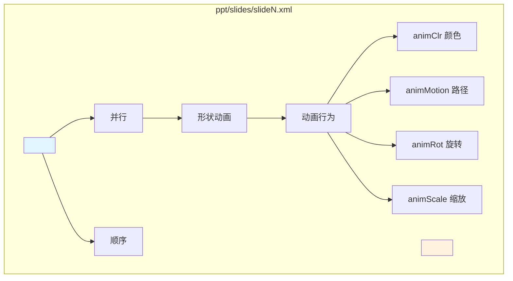

# AI 能否自动生成 PPT 动画？

> 调研问题：AI 能否自动生成 PPT 动画？现有方案有哪些？
>
> 调研日期：2026-09-17

---

## 🎯 问题

1. python-pptx 能否创建动画？
2. AI 生成 PPT 动画的可行方案有哪些？
3. 难点在哪里？

---

## ✅ 结论

### 1. python-pptx 不支持创建形状动画

python-pptx **可以读取**动画 XML（保留在 `p:timing` 元素里），但**没有公共 API**来创建或修改形状动画。

证据：`src/pptx/oxml/slide.py:303-309` 的 `CT_SlideTiming` 类存在，但没有公共方法供外部调用。

### 2. 现有可行方案

| 方案 | 形状动画 | 幻灯片切换 | 可用性 |
|------|:--------:|:----------:|:------:|
| **python-pptx（官方）** | ❌ | ⚠️ 仅读取 | ✅ 读取/保留，❌ 创建 |
| **python-pptx + 裸 XML 操作** | ✅ | ✅ | ⚠️ 需了解 schema |
| **商业 AI 工具（Gamma/Tome）** | ✅ | ✅ | 💰 付费 |

---

## 🔧 PPT 动画技术实现方式

### OOXML 架构

PPTX 本质是 ZIP 包，动画数据存在 `ppt/slides/slideN.xml` 的 `<p:timing>` 元素里：

**要点：**
- 形状动画通过 SMIL-like 语法定义
- 动画行为描述**什么在变**：颜色、位置、旋转、缩放
- 时间容器（`par`/`seq`）控制**什么时候变**

---

## 🤔 难点分析

### 难点 1：动画 schema 极其复杂

OOXML 动画系统基于 SMIL，schema 定义跨越多个命名空间，MS-PPTX 规范中有数百页。

### 难点 2：形状 ID 依赖关系

动画 XML 引用 `<p:spTgt spid="42"/>`，需要知道目标形状的 ID。

### 难点 3：时间线一致性

动画时间线有 ID 引用链，新增动画节点需要维护 ID 唯一性。

### 难点 4：AI 生成语义困难

「添加淡入动画」比「添加形状」复杂得多：
- 动画有类型选择（淡入、飞入、擦除…）
- 有时长、延迟、触发方式
- 有缓动曲线
- 有多元素协同

---

## 📁 AI 生成 PPT 动画的可行路径

### 路径 A：python-pptx + 裸 XML 拼接

⚠️ 可行但脆弱，需要手写正确的 XML 结构，不适合通用 AI 生成。

### 路径 B：基于模板的动画填充

1. 手工创建「动画模板 PPTX」
2. 用 Python 找到模板中的 placeholder shape ID
3. 替换为实际形状 ID
4. 合并 timing 树

**评价：** ✅ 更可靠，适合「从预设动画库选择」的 AI 场景

### 路径 C：商业 API / 云服务

- Gamma、Tome 等内置动画
- 通过 API 调用生成完整 PPT（含动画）
- **评价：** 💰 成本高，定制化程度低

---

## 📚 参考来源

### python-pptx 源码

| 文件 | 行号 | 内容 |
|------|------|------|
| `src/pptx/oxml/slide.py` | 303-309 | `CT_SlideTiming` 类定义 |
| `src/pptx/shapes/shapetree.py` | 635-648 | `_add_video_timing()` 实现 |
| `docs/dev/analysis/shp-movie.rst` | 703-734 | `p:timing` schema 定义 |

---

## 🔬 查证过程

| 预想 | 让它站不住的材料 | 现在的写法 |
|------|------------------|------------|
| python-pptx 完全不支持动画 | `CT_SlideTiming` 类存在 | 修正为「不支持创建，但支持保留」 |
| 有现成 python-pptx-animation 库 | GitHub 未发现活跃专门库 | 改为「需要裸 XML 操作」 |

---

## 🧭 对我们的影响

1. **动画暂不可行**：python-pptx 不支持创建动画，短期内不建议投入
2. **未来方案**：如果需要动画，考虑「模板填充」路径 B
3. **明确边界**：当前阶段只做静态 PPT 生成
