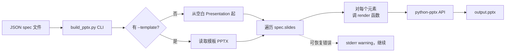

# JSON → PPT Skill Spec（第一版）

## 🎯 问题陈述

现在 GPT-PPT-Generator 项目的 `images-to-editable-pptx` skill 已经能做「图片 → 可编辑 PPT」，但它的入口是 PNG 图片目录 + 人工填 JSON spec。

如果用户**已经有结构化内容**（大纲、Markdown、表格数据），想要直接得到可编辑 PPT 而不是先走图片生成流程，目前没有直接路径。他们必须先让 LLM 出 JSON spec，再调渲染器，过程是手动的。

需要的是一个**直接接受 JSON spec 输入**、**渲染为原生 PPTX** 的 skill，让 GPT/Claude 生成的 JSON 能被直接消费。

---

## 💡 解决方案

在 `skills/json-to-ppt/` 下新建 skill：

- 📥 输入：单个 JSON spec 文件（按新 `references/spec-format.md` 扩展版定义）
- 📤 输出：原生可编辑 `.pptx`
- ⚙️ 调用方式：CLI 命令 `python scripts/build_pptx.py spec.json output.pptx [--template <file.pptx>]`
- 🔧 渲染引擎：python-pptx（已验证可行，见 [json-to-ppt-landscape.md](research/json-to-ppt-landscape.md)）
- 🧱 支持的元素类型：text、shape、line、table、bar_chart、image（防护性拒绝全页源图）
- 🚫 v1 不带 `--validate`：渲染失败以 warning 形式输出，CLI 自身硬错才非零退出

完成之后，用户只需让 GPT 生成符合 schema 的 JSON，就能一键得到可编辑 PPT，不再依赖图片生成流程。

---

## 👤 用户故事

1. 作为内容创作者，我已经用 GPT 生成了演讲稿大纲 JSON，希望直接拿到可编辑 PPT 文件
2. 作为开发者，我能用 Claude 生成结构化 PPT 内容，希望能自动渲染而不是手动用 PowerPoint 操作
3. 作为团队成员，我想给团队分享一份用 JSON 描述的会议纪要 PPT，对方能直接打开 `.pptx` 修改

---

## 🏗️ 实现决策

### Grill-me 决定（定稿）

| 编号 | 决策点 | 选定 |
|:--|:--|:--|
| 范围 | 仅做 JSON → PPTX 渲染 | a：只渲染 |
| Schema | 元素类型扩展方式 | b：扩展（向后兼容） |
| 输入 | 单 JSON / 单 PPTX | a：单 JSON → 单 PPTX |
| 测试 seam | 测试边界 | a：CLI 端到端 |
| **Q1** 暴露方式 | skill 放哪里 | **b**：单独 `skills/json-to-ppt/` 目录 |
| **Q2** 向后兼容 | 与 `images-to-editable-pptx` 的关系 | **a**：100% 向后兼容 |
| **Q3** validate 选项 | v1 是否带 `--validate` | **a**：v1 不加 `--validate` |
| **Q4** 失败行为 | 渲染异常时的退出策略 | **b**：打印 warning，继续渲染 |

### 工程决策

- 📦 **复用现有渲染逻辑**：直接抽取 `skills/images-to-editable-pptx/scripts/build_editable_pptx.py` 作为新 skill 的核心脚本，不重写 python-pptx 调用层。已经过验证，重写会带风险且没收益。
- 📐 **扩展 JSON Schema（向后兼容）**：新 skill 的 `references/spec-format.md` 是原 spec 的超集，**不删除** `images-to-editable-pptx` 的 spec-format。原 JSON 文件在新 skill 下应仍能渲染。
- 🚪 **入口脚本独立**：新建 `scripts/build_pptx.py` 作为 CLI 入口，**不直接复用** `build_editable_pptx.py`。CLI 入口有参数解析、错误处理、文件校验等额外职责，不应该和库逻辑混在一起。新 CLI 内部 `from build_editable_pptx import render` 调用渲染函数。
- 🛡️ **安全门保留**：原 `validate_editable_pptx.py` 的全页图片防护逻辑必须保留并扩展（即使没有源图片，也要拒绝 ≥90% 面积的非授权图片资产）。什么时候要重新讨论：当用户明确要求嵌入整页背景图作为合法用例时。
- 🧩 **支持模板输入**：CLI 加 `--template <file.pptx>` 参数，把生成的元素追加到现有模板的幻灯片之后，保留模板的母版/配色/动画。什么时候要重新讨论：当用户想替换模板母版的颜色/字体时——目前的实现只追加不修改母版。
- ⏸️ **不做动画**：第一版明确不支持任何 PPT 动画。依据 [ai-ppt-animation.md](research/ai-ppt-animation.md)：python-pptx 没有公共 API 创建形状动画，OOXML schema 复杂。如果用户要动画，下载后手动加。
- ⚠️ **失败即 warning，不阻断**：渲染过程中遇到可恢复错误（缺字段、坐标越界等）打印 warning 到 stderr 并继续；只有 CLI 自身的硬错（JSON 解析失败、输出路径不可写）才非零退出。

---

## 🧪 测试决策

- **测试 seam**：CLI 端到端（`scripts/build_pptx.py spec.json out.pptx`）。**只测外部行为**：能否打开生成的 PPTX、幻灯片数量、元素类型是否符合预期、文字是否可编辑。不测 python-pptx 内部 API。
- **测试 fixture**：用 `tests/fixtures/` 下的若干 JSON spec 样本（覆盖：纯文字、多元素组合、表格、含模板路径）。每个 fixture 对应一个 expected.pptx 断言文件。
- **不写视觉回归测试**：第一版不做像素级对比（python-pptx 输出在不同 Office 版本下像素可能略有差异），只测结构（元素类型、坐标、文字内容）。
- **测试先例**：`tests/test_editable_pptx_skill.py` 已有对 `build_editable_pptx.py` 的端到端测试，新 skill 的测试结构和它对齐。

---

## 🚫 范围外

- 🚫 **图像生成/AI 视觉识别**：本 skill 只接受 JSON 输入，不调任何图像模型。图片型 PPT 重建走 `images-to-editable-pptx`。
- ⏸️ **PPT 动画**：第一版明确不支持（见实现决策）。
- 🚫 **v1 不带 `--validate`**：渲染后不自动跑结构校验。结构校验留给下游工具或后续版本。
- 🚫 **在线编辑预览**：不提供网页端预览/编辑器。交付物是 `.pptx` 文件。
- 🚫 **JSON spec 自动生成**：本 skill 不提供「Markdown → JSON」或「文本 → JSON」的转换，那是上游 LLM 的职责。
- 🚫 **修改母版颜色/字体**：只追加幻灯片，不修改现有模板的母版。

---

## 📎 附注

- 本 spec 与 [gpt-ppt-generator-as-skill.md](research/gpt-ppt-generator-as-skill.md) 调研结论一致：JSON → PPTX 是 skill 拆分的明确子模块。
- 渲染层的代码 80% 复用自 `images-to-editable-pptx/scripts/build_editable_pptx.py`，新 skill 主要工作在 CLI 入口 + 模板参数 + schema 扩展。
- 第一版完成后，下一步可以建 `markdown-to-json-ppt` skill（接受 Markdown 输入，调用 LLM 生成 JSON spec，再调本 skill 渲染）。