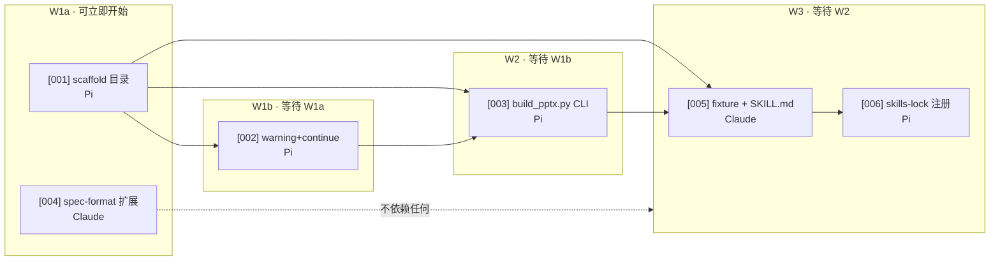

# v1 批次 · `json-to-ppt` Skill 第一版

> 本目录是 `json-to-ppt` skill **第一版**的整套实现 ticket。第一版完成后，本目录冻结；下一版本另起目录（例如 `002-...`）。

## 批次目标

按 [`.workflow/specs/json-to-ppt-skill.md`](../../specs/json-to-ppt-skill.md) 在仓库里交付：

- 📁 新 skill `skills/json-to-ppt/`
- ⚠️ 渲染失败 = warning + continue（旧 skill 同步得到这个行为）
- 🧩 CLI `build_pptx.py` 支持 `--template` 追加
- 📐 schema 向后兼容 + 文档化两个新字段（`slide.template`、`background.image`）
- 🧪 4 个 fixture + 端到端测试 + 新 SKILL.md
- 📇 `skills-lock.json` 注册

## 拓扑与依赖



冲突面：

- `T002` 和 `T003` **都改 `build_editable_pptx.py`**——`T003` 走「给 `build_pptx()` 加 `existing_presentation` 参数」路线时，`T002` 的 warning 路径必须先就位
- 建议做法：T002 + T003 同 PR（先 T002 落地，T003 紧跟），或 T003 在 T002 PR 之上继续
- T004 跟旧 skill 完全无交集，可以和 W1a/W1b 并行跑，不占 W2 槽位

## 分派清单（可直接复制进 CodeG）

```markdown
🟢 可立即开始
- [001] scaffold skills/json-to-ppt/ → Pi
- [004] spec-format.md 扩展 → Claude

🟡 等待 [001]
- [002] warning+continue 错误路径 → Pi

🟠 等待 [002]
- [003] build_pptx.py CLI + --template → Pi  （走选项 a：T002 同步加 `existing_presentation` 参数）

🔴 等待 [003]
- [005] fixture + SKILL.md → Claude
- [006] skills-lock.json 注册 → Pi
```

并发上限 3 → W1a 跑 T001 + T004（并行）；W2 单跑 T003（依赖 T002）；W3 三路串行收尾。

## T003 决策（已拍板）

✅ **2026-09-18 选定选项 a**：给旧 `build_pptx()` 加 `existing_presentation: Presentation | None = None` 参数。

详细三方案对照见 [003-build-pptx-cli-shell-with-template.md](./003-build-pptx-cli-shell-with-template.md) 的「🧭 上下文」段。

同步动作：

1. **T002 的任务描述扩展**：除了"warning + continue"，还要在 `build_pptx()` 签名上加 `existing_presentation` 参数（默认 `None`，传 Presentation 对象时跳过 `presentation = Presentation()` 这一步）。
2. **T002 与 T003 串行**：T002 PR 落库后 T003 才能开工——已在拓扑图里体现（T003 在 W2，紧跟 W1b 的 T002）。
3. **PR 合并策略**：建议 T002 和 T003 拆 PR，但 T003 PR 必须 `git rebase` 到 T002 之后；如果合并冲突难解，合并为一个 PR 也可。

## Ticket 清单

| ID | 文件 | Agent | 关键产出 |
|:--|:--|:--|:--|
| [001](001-scaffold-skill-directory.md) | scaffold 目录 | Pi | `skills/json-to-ppt/{scripts,references,agents}/` + SKILL.md 占位 |
| [002](002-warning-continue-error-path.md) | warning+continue | Pi | `build_pptx()` 元素级异常 → stderr warning，CLI 整体仍返回 0 |
| [003](003-build-pptx-cli-shell-with-template.md) | build_pptx.py CLI | Pi | 新 CLI 入口 + `--template` 追加模式 |
| [004](004-extend-spec-format.md) | spec-format 扩展 | Claude | `references/spec-format.md` 是旧 spec 的超集 |
| [005](005-test-fixtures-and-skill-md.md) | fixture + SKILL.md | Claude | 4 fixture + pytest + 真实 SKILL.md |
| [006](006-skills-lock-registration.md) | skills-lock 注册 | Pi | `skills-lock.json` 新增条目 |

## 完成本批次的定义（Done Criteria）

✅ 全部 6 个 ticket 合并到主分支
✅ `python -m pytest` 退出码 0
✅ `python skills/json-to-ppt/scripts/build_pptx.py <spec> <out> --template <base.pptx>` 端到端可用
✅ `skills-lock.json` 含 `json-to-ppt`
✅ `git tag v1-json-to-ppt` 打上版本标签

## 提交与派发

- 📤 `git add .workflow/` 后推送到服务器仓库
- 🚀 在服务器 CodeG 跑 `/dispatch`，按上面分派清单建任务