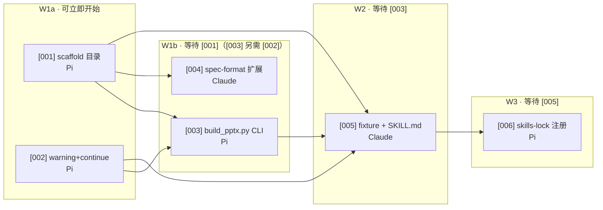

# v1 批次 · `json-to-ppt` Skill 第一版

> 本目录是 `json-to-ppt` skill **第一版**的整套实现 ticket。第一版完成后，本目录冻结；下一版本另起目录（例如 `002-...`）。

## 批次目标

按 [`.workflow/specs/json-to-ppt-skill.md`](../../specs/json-to-ppt-skill.md) 在仓库里交付：

- 📁 新 skill `skills/json-to-ppt/`
- ⚠️ 渲染失败 = warning + continue（旧 skill 同步得到这个行为）
- 🧩 CLI `build_pptx.py` 支持 `--template` 追加
- 📐 schema 向后兼容 + 文档化两个新字段（`slide.template`、`background.image`）
- 🧪 4 个 fixture + 端到端测试 + 新 SKILL.md
- 📇 `skills-lock.json` 注册

## 拓扑与依赖



冲突面：

- `T002` 和 `T003` **都改 `build_editable_pptx.py`**——`T003` 走「给 `build_pptx()` 加 `existing_presentation` 参数」路线时，`T002` 的 warning 路径必须先就位
- 建议做法：T002 + T003 同 PR（先 T002 落地，T003 紧跟），或 T003 在 T002 PR 之上继续
- T004 只写 `skills/json-to-ppt/references/spec-format.md`，跟旧 skill 内容零交集；但它落在 [001] 新建的目录里，所以阻塞 [001]。等 [001] 合并后可与 [003] 并行，不占 W2 槽位
- T001 除占位 `SKILL.md` 外还要在三个子目录放空的 `.gitkeep`（git 不追踪空目录，缺了它脚手架合并后会消失）。T001 的验收标准已含 `git ls-files skills/json-to-ppt | wc -l` = 4

## 分派清单（可直接复制进 CodeG）

```markdown
🟢 可立即开始
- [001] scaffold skills/json-to-ppt/ → Pi
- [002] warning+continue 错误路径 → Pi

🟡 等待 [001]
- [004] spec-format.md 扩展 → Claude

🟠 等待 [001] + [002]
- [003] build_pptx.py CLI + --template → Pi  （走选项 a：T002 同步加 `existing_presentation` 参数）

🔴 等待 [003]
- [005] fixture + SKILL.md → Claude

⚫ 等待 [005]
- [006] skills-lock.json 注册 → Pi
```

并发上限 3 → W1a 跑 T001 + T002（并行，改的文件不重叠：001 新建 `skills/json-to-ppt/`，002 改旧 `build_editable_pptx.py`）；W1b 跑 T003 + T004（并行）；W2 单跑 T005；W3 单跑 T006。

## 环境前提（2026-09-18 修好）

派发后第一轮暴露出的环境缺口，已在本机（服务器 CodeG）修掉：

| 缺口 | 症状 | 处置 |
|:--|:--|:--|
| `python` 命令不存在（只有 `python3`） | preflight `python -m pytest` exit 127，所有验收命令失效 | `ln -s /usr/bin/python3 /usr/local/bin/python` |
| 项目依赖全缺（pytest / python-pptx / flask / requests / Pillow） | 即便有 `python` 也 import 失败 | `pip3 install -r requirements-dev.txt` |

验证：仓库根 `python -m pytest -q` → `22 passed`，exit 0。

未修（不影响任务）：服务器侧 git 无 `user.name`/`user.email`，提交作者退化为 `root@<主机名>`；`git push` 需显式带 CodeG 的 credential helper。

## CodeG 任务对照表

全 6 张 ticket 已建为 CodeG To-dos（folder GPT-PPT-Generator），`auto_process` 开启时会自动按 sort_order 领取：

| ticket | CodeG task | Agent | 状态（截至 2026-09-18 10:47） |
|:--|:--|:--|:--|
| [001] scaffold | #6 | Pi | ✅ done 已合并 |
| [002] warning+continue | #7 | Pi | ✅ done 已合并（验收标准 2 的测试已豁免） |
| [004] spec-format 扩展 | #8 | Claude | 🔄 running |
| [003] CLI + `--template` | #9 | Pi | 🔄 running |
| [005] fixture + SKILL.md | #10 | Claude | 🔄 running（前置门禁：会因 [003] 未合并而自停，等 #9 合并后重跑） |
| [006] skills-lock 注册 | #11 | Pi | ⏳ queued（前置门禁：等 [005]） |

`005` 与 `006` 的任务描述里各有一段**前置门禁**：开工前先检查上游产物是否存在，不满足就直接回「被阻塞，未开始」并结束。这是为了在自动领取（auto_process）下避免抢跑——代价是被拦下的那轮任务会以"零改动"落进 Review，等上游合并后重跑即可。

## 状态行与阻塞边口径

- 每张 ticket 文件首行是状态行 `<!-- status: todo -->`；`/dispatch` 靠它扫未完成 ticket，派发后改成 `<!-- status: dispatched to:<agent> via:codeg-todos at:<时间> -->`，合并后改 `done`
- **阻塞边以各 ticket 自己的「🚧 阻塞」段为唯一口径**，本 INDEX 与 [spec→tickets handoff](../../handoffs/2026-09-18_spec-to-tickets.md) 的拓扑图与之一致
- 2026-09-18 修正两处旧不一致：删掉 `T001 → T002` 边（T002 只改旧 skill，不依赖新目录）；加上 `T001 → T004` 边（T004 要写进 `references/`）
- 本 INDEX 不是 ticket，没有状态行，不参与 `/dispatch` 扫描

## T003 决策（已拍板）

✅ **2026-09-18 选定选项 a**：给旧 `build_pptx()` 加 `existing_presentation: Presentation | None = None` 参数。

详细三方案对照见 [003-build-pptx-cli-shell-with-template.md](./003-build-pptx-cli-shell-with-template.md) 的「🧭 上下文」段。

同步动作：

1. **T002 的任务描述扩展**：除了"warning + continue"，还要在 `build_pptx()` 签名上加 `existing_presentation` 参数（默认 `None`，传 Presentation 对象时跳过 `presentation = Presentation()` 这一步）。
2. **T002 与 T003 串行**：T002 PR 落库后 T003 才能开工——已在拓扑图里体现（T003 在 W2，紧跟 W1b 的 T002）。
3. **PR 合并策略**：建议 T002 和 T003 拆 PR，但 T003 PR 必须 `git rebase` 到 T002 之后；如果合并冲突难解，合并为一个 PR 也可。

### 派发后追加的三条约束（2026-09-18，T002 实测暴露）

T002 落地后实测发现，光有 `existing_presentation` 还不够——已写进 [003 的「🧷 已拍板的设计约束」](./003-build-pptx-cli-shell-with-template.md#-已拍板的设计约束2026-09-18-派发后补t002-实测暴露)：

| 编号 | 约束 | 证据 |
|:--|:--|:--|
| D1 | `--template` 模式下**模板尺寸优先**，spec 的 `slide_size` 不一致时忽略并 warning | `build_editable_pptx.py:502-503` 无条件覆盖尺寸；实测 10×7.5in 模板 → 输出 13.333×7.5in |
| D2 | 不得盲目用 `slide_layouts[6]`；按名称挑空白版式，越界要明确报错非零退出 | `build_editable_pptx.py:505` 硬编码索引 6 |
| D3 | CLI 参数口径统一 `--spec/--out`（`--template` 为可选追加项） | 旧 CLI 与旧 SKILL.md 都是 `--spec/--out`；T003 原验收命令误写为位置参数。spec 里那两处位置参数写法也已同步修订（见 spec 末尾「修订记录」） |

D1 同时放宽了 T003「不修改 `images-to-editable-pptx` 任何文件」的约束——尺寸那一段允许改。

## Ticket 清单

| ID | 文件 | Agent | 关键产出 |
|:--|:--|:--|:--|
| [001](001-scaffold-skill-directory.md) | scaffold 目录 | Pi | `skills/json-to-ppt/{scripts,references,agents}/` + SKILL.md 占位 |
| [002](002-warning-continue-error-path.md) | warning+continue | Pi | `build_pptx()` 元素级异常 → stderr warning，CLI 整体仍返回 0 |
| [003](003-build-pptx-cli-shell-with-template.md) | build_pptx.py CLI | Pi | 新 CLI 入口 + `--template` 追加模式 |
| [004](004-extend-spec-format.md) | spec-format 扩展 | Claude | `references/spec-format.md` 是旧 spec 的超集 |
| [005](005-test-fixtures-and-skill-md.md) | fixture + SKILL.md | Claude | 4 fixture + pytest + 真实 SKILL.md |
| [006](006-skills-lock-registration.md) | skills-lock 注册 | Pi | `skills-lock.json` 新增条目 |

## 完成本批次的定义（Done Criteria）

✅ 全部 6 个 ticket 合并到主分支
✅ `python -m pytest` 退出码 0
✅ `python skills/json-to-ppt/scripts/build_pptx.py <spec> <out> --template <base.pptx>` 端到端可用
✅ `skills-lock.json` 含 `json-to-ppt`
✅ `git tag v1-json-to-ppt` 打上版本标签

## 提交与派发

- 📤 `git add .workflow/` 后推送到服务器仓库
- 🚀 在服务器 CodeG 跑 `/dispatch`，按上面分派清单建任务