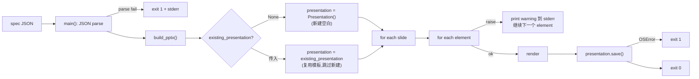

<!-- status: dispatched to:pi via:codeg-todos at:2026-09-18T09:51:49+08:00 task:#7 in_review 代码已完成（e9dd00f）；验收标准 2 的测试经确认不补，豁免记录见 handoff -->

# [002] 失败即 warning，不阻断渲染

## 📌 Spec 引用
来源：[`.workflow/specs/json-to-ppt-skill.md`](../specs/json-to-ppt-skill.md) 的「⚠️ 失败即 warning，不阻断」「Q4 失败行为 b」

## 🎯 任务
让 `skills/images-to-editable-pptx/scripts/build_editable_pptx.py` 的 `build_pptx()` 把"单个元素渲染失败"从 `raise ValueError` 改为 `print(..., file=sys.stderr)` 然后继续渲染下一张幻灯片；CLI 整体仍然返回 0，除非 `JSON 解析失败` 或 `output 路径不可写`。

现在 `build_pptx()` 在第 543–553 行把所有元素级异常 `raise` 出来，遇到一个坏元素就整体失败。任务完成后：

- 一个含坏元素的 spec 仍能生成 PPTX，stderr 列出哪些 slide/element 失败
- 整个 deck 仍然写到 `--out`
- JSON 解析失败或 output 不可写时仍然非零退出
- 旧调用方（`tests/test_editable_pptx_skill.py`、CLI 直接调用）行为尽量保持：返回的 `output_path` 仍然是 Path

## ✅ 验收标准
1. `python -m pytest tests/test_editable_pptx_skill.py -q` 全部通过
2. 新加端到端测试：构造一个含坏元素的 spec（`type: "shape"` 但 `shape: "unsupported"`）调 `build_pptx()`，断言：
   - 返回的 Path 存在
   - stderr 输出包含 `Slide 1 element 1`
   - 返回值非 None
3. CLI 调用一个故意写错 `path` 字段的 image 元素 spec，断言 exit code 仍为 0，PPTX 文件确实生成
4. CLI 调用一个完全不是 JSON 的文件，断言 exit code != 0
5. CLI 调用 `--out` 指向只读目录，断言 exit code != 0

## 🧪 测试 seam
- pytest 端到端：`tests/test_editable_pptx_skill.py` 加新 case
- shell：`python scripts/build_editable_pptx.py <bad-spec.json> /tmp/out.pptx; echo $?`

## 🚧 阻塞
- 无（可立即开始）

## 🤖 建议 Agent
Pi
理由：行为调整 + 测试用例，属于 `service-layer` 改动；不算架构

## 🌿 分支
`ticket/002-warning-continue-error-path`

## 🏃 执行约定
- **直接动手，不要先出计划等确认**——本 ticket 已定稿，实现 → 跑验收命令 → 提交，一次做完
- 分支由 CodeG 管理（`task/<id>`）：不要自建分支、不要 push、不要改 `.workflow/`
- 验收命令必须真跑，并把**实际输出**贴回结果；跑不起来就直说，不要声称通过
- 环境已修好：`python` 与 `python -m pytest` 在本机可用（2026-09-18 装好依赖），不要再以"命令不存在"为由跳过验收

## 🧭 上下文
- 改的函数：`build_pptx()` 在 `skills/images-to-editable-pptx/scripts/build_editable_pptx.py:478`
- 关键循环：`build_pptx()` 内 `for element_index, element in enumerate(elements, start=1):` 块（第 539–559 行）
- `presentation.save(output_path)` 仍然要执行
- CLI 在 `main()`（同文件 551 行）；`json.loads(args.spec.read_text(...))` 是 JSON 解析点；`build_pptx()` 之前加 try/except JSONDecodeError
- 旧 `tests/test_editable_pptx_skill.py:24` 用 `builder.build_pptx(spec, output, tmp_path)` 直接调用——保持签名兼容
- 不要触碰 `validate_editable_pptx.py`；它独立于渲染路径
- ⚠️ 这是改**现有** skill 的文件，必须保证 `images-to-editable-pptx` 的旧行为（含 `--allow-full-bleed-images`）不变
- ⚠️ **同步动作（T003 决策落地）**：本 ticket 必须**同时**给 `build_pptx()` 加一个 `existing_presentation: Presentation | None = None` 形参。当传入时，`build_pptx()` 跳过内部的 `presentation = Presentation()`，直接复用传入的对象作为渲染目标。详见 [003-build-pptx-cli-shell-with-template.md](./003-build-pptx-cli-shell-with-template.md) 的决策段——T003 走"给旧 `build_pptx()` 加 `existing_presentation` 参数"路线，本次 ticket 必须先把这条路铺好。

